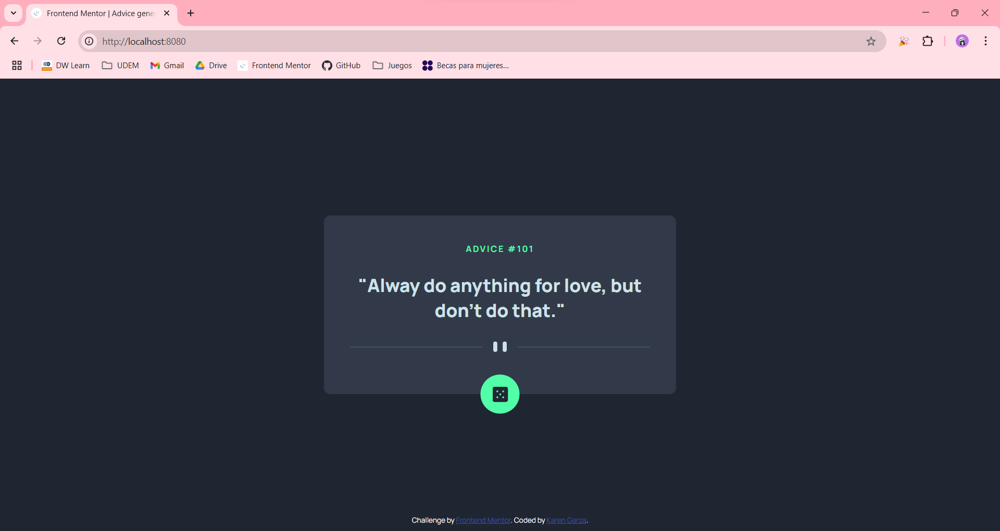

# Frontend Mentor - Advice generator app solution

This is a solution to the [Advice generator app challenge on Frontend Mentor](https://www.frontendmentor.io/challenges/advice-generator-app-QdUG-13db). Frontend Mentor challenges help you improve your coding skills by building realistic projects.

## Table of contents

- [Overview](#overview)
  - [The challenge](#the-challenge)
  - [Screenshot](#screenshot)
  - [Links](#links)
- [My process](#my-process)
  - [Built with](#built-with)
  - [Useful resources](#useful-resources)
  - [Running the project locally](#running-the-project-locally)
- [Author](#author)
- [Acknowledgments](#acknowledgments)

## Overview

### The challenge

Users should be able to:

- View the optimal layout for the app depending on their device's screen size
- See hover states for all interactive elements on the page
- Generate a new piece of advice by clicking the dice icon

### Screenshot



### Links

- [Live site URL](https://your-live-site-url.com)

## My process

### Built with

- Semantic HTML5 markup
- CSS Flexbox
- JavaScript
- [Vue.js](https://vuejs.org/) - JavaScript framework

### Useful resources

- [Advice Slip JSON API](https://api.adviceslip.com/) - This is where all the advices come from.
- [JavaScript Fetch API](https://www.w3schools.com/jsref/api_fetch.asp) - This helped me to use fetch correctly.
- [Media Queries with JavaScript](https://www.w3schools.com/howto/howto_js_media_queries.asp) - This helped me to change the divider icon depending on the size of the screen.

### Running the project locally

```
npm install
npm run serve
```

## Author

- Frontend Mentor - [@KarenNR](https://www.frontendmentor.io/profile/KarenNR)

## Acknowledgments

The [Advice Slip JSON API](https://api.adviceslip.com/) sometimes returned the same data. [This link](https://stackoverflow.com/questions/71255840/fetch-api-return-same-data-always) (see Marcos Fitzsimons' answer) provided a solution to avoid this.